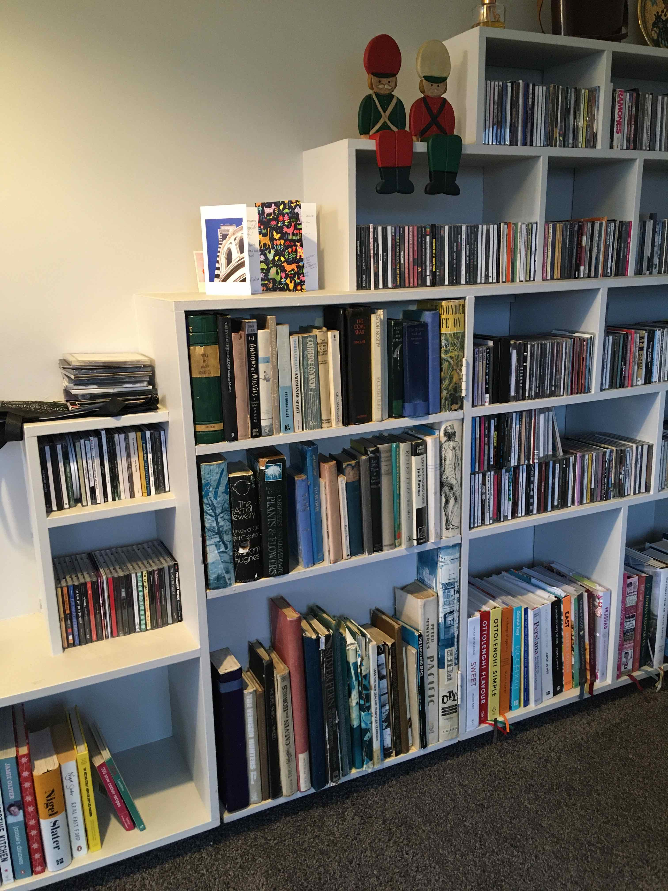
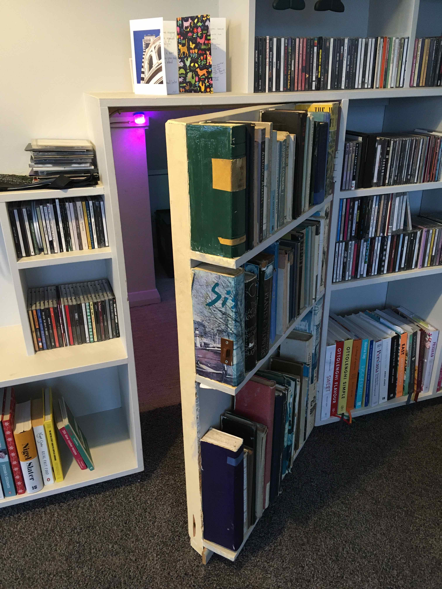
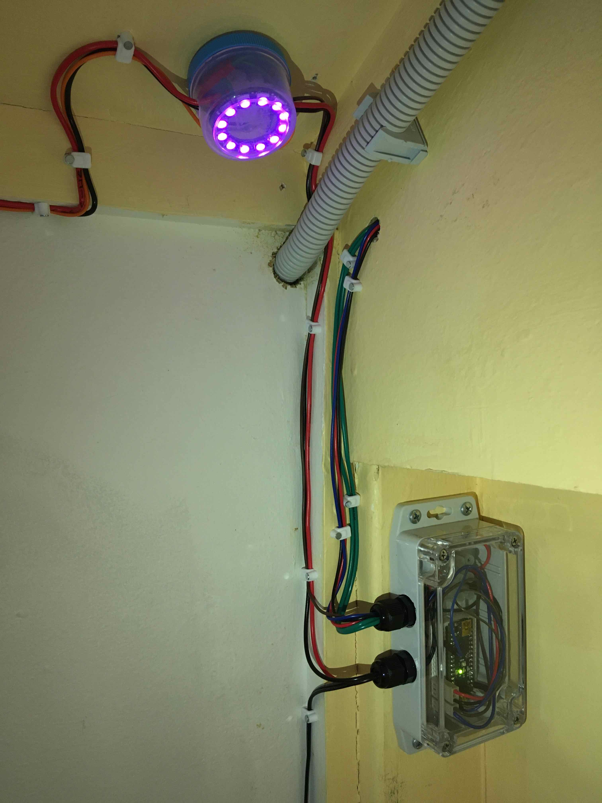
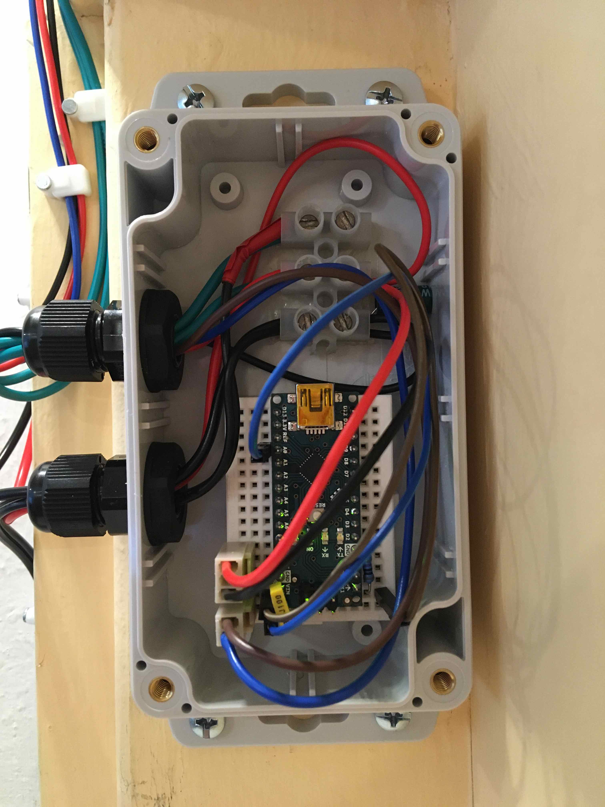
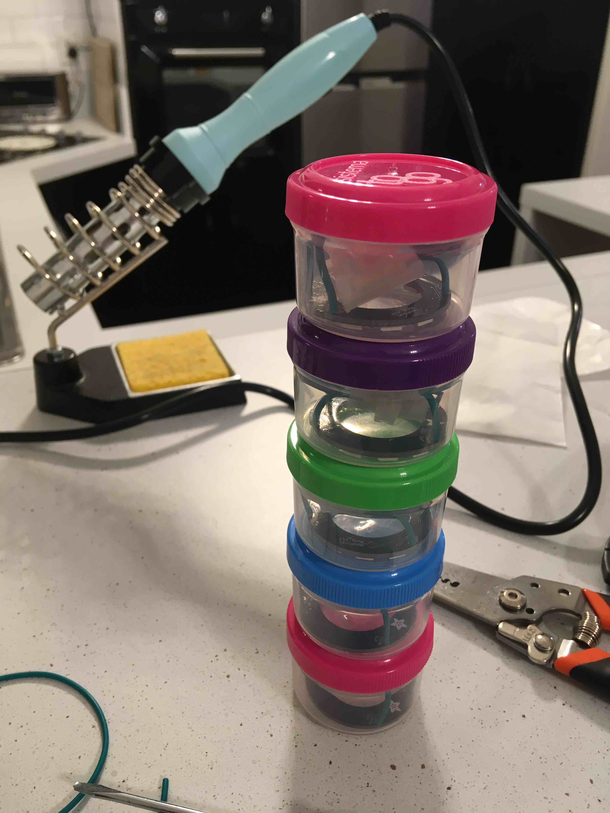
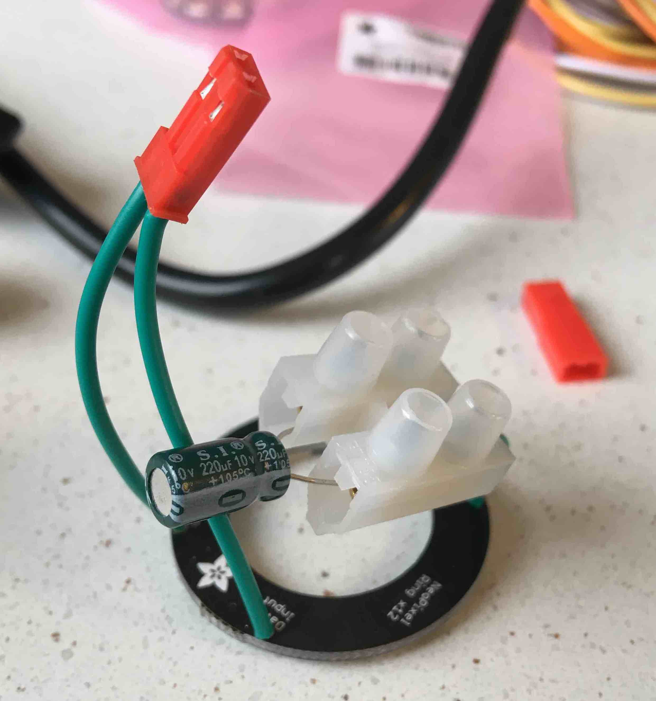
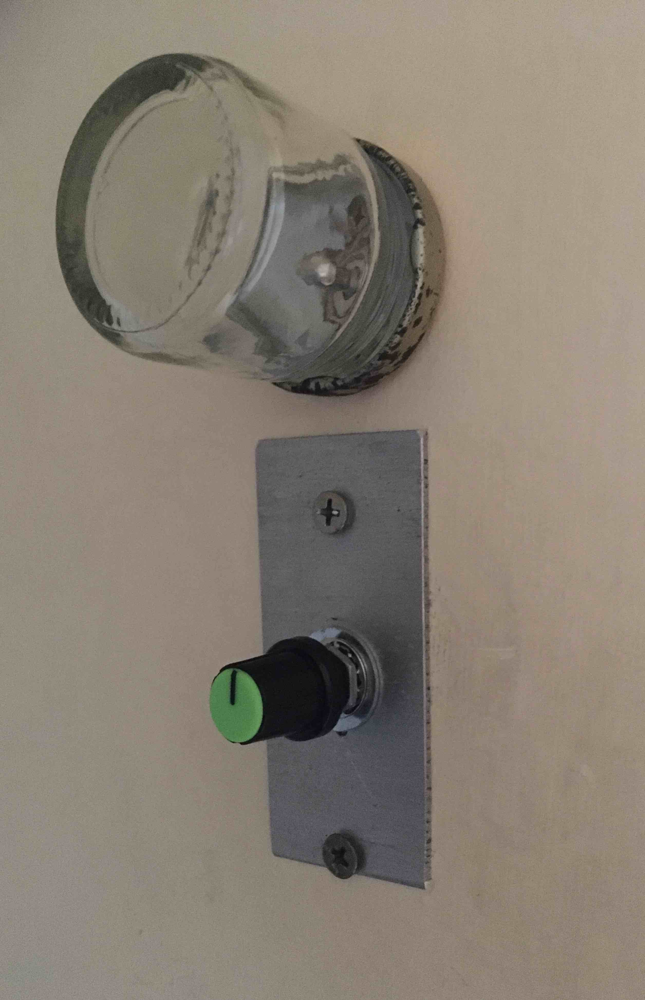
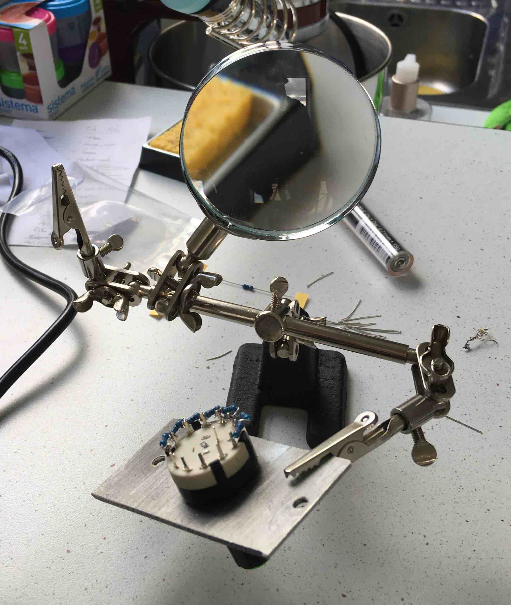

# NeoPixel Lighting Controller

[`NeoPixels.ino`](NeoPixels.ino) contains the code needed to run the lighting
set-up in the secret room. See the gallery at the end of the document!

### Circuit

The circuit consists of:
 + An [Arduino Nano](https://www.arduino.cc) running the aforementioned code.
 + A set of five 12-LED NeoPixel rings.
 + An on/off switch, and a rotary switch (eight stops) for selecting different
   lighting modes.
 + A 5V, 3A DC power supply.

Each NeoPixel ring is housed in a plastic container, along with a screw
terminal strip which allows power to be tapped off the main line. A 220μF
capacitor provides a small, local buffer for sudden current changes. Finally, a
2-way JST connector is used for the data input / output wires. These are then
wired around the room.

The rotary switch has a 1kΩ resistor wired between each adjacent terminal, and
the 5V DC is applied across the full set. This resistive ladder gives a
different voltage at the common terminal for each position, and this can be
read by an analog pin on the Arduino. A 100nF capacitor is wired between the
pin and ground to smooth out voltage fluctuations while switching (e.g. as
terminal is disconnected between stops).

Finally, the Arduino takes its power from the same power supply (with another
220μF capacitor), and is connected to the NeoPixel data wire via a 330Ω
resistor.

### Useful links

 + Adafruit NeoPixel Überguide: <https://learn.adafruit.com/adafruit-neopixel-uberguide>
 + NeoPixel library (including `RGBWstrandtest.ino`): <https://github.com/adafruit/Adafruit_NeoPixel>
 + Rotary switch wiring: <https://www.instructables.com/Arduino-Rotary-Switch-One-Analogue-Input/>
 + More rotary switch notes: <https://forum.arduino.cc/t/arduino-and-six-positions-rotary-switch/>
 + Arduino notes on signed/unsigned integer calculations: <https://www.arduino.cc/reference/en/language/variables/data-types/unsignedint/>

----------

### Gallery

----------

Written in [CommonMark-flavoured Markdown](https://commonmark.org/) using the
associated [live testing tool](https://spec.commonmark.org/dingus/).
